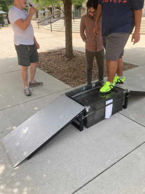
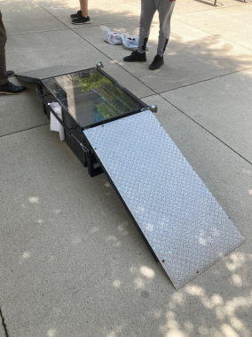
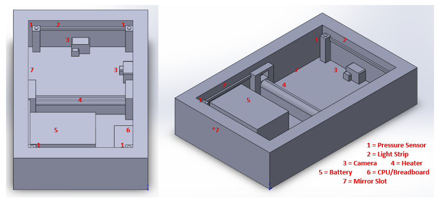
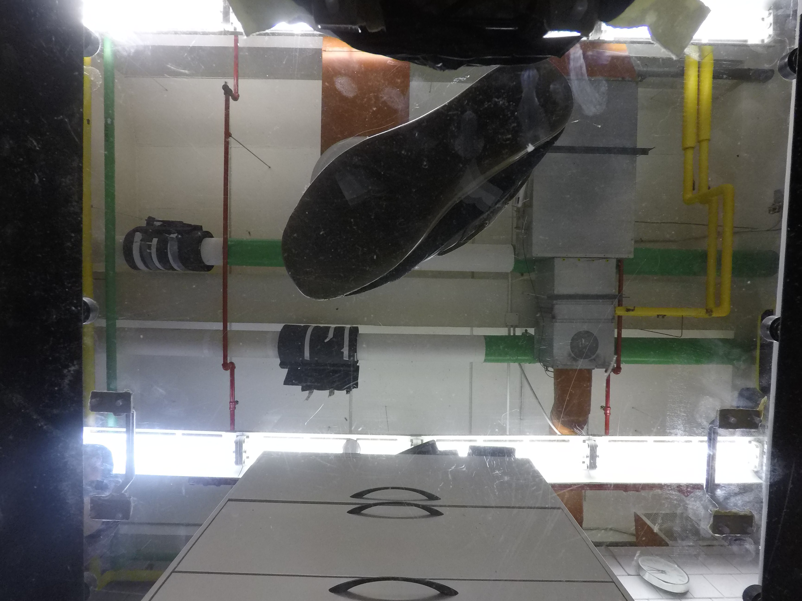
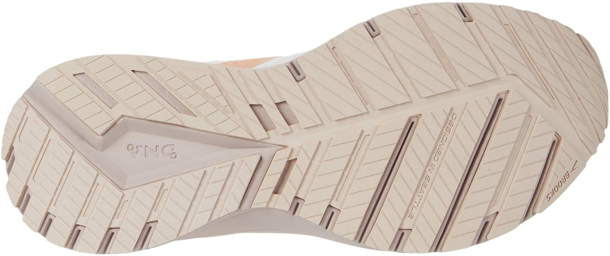
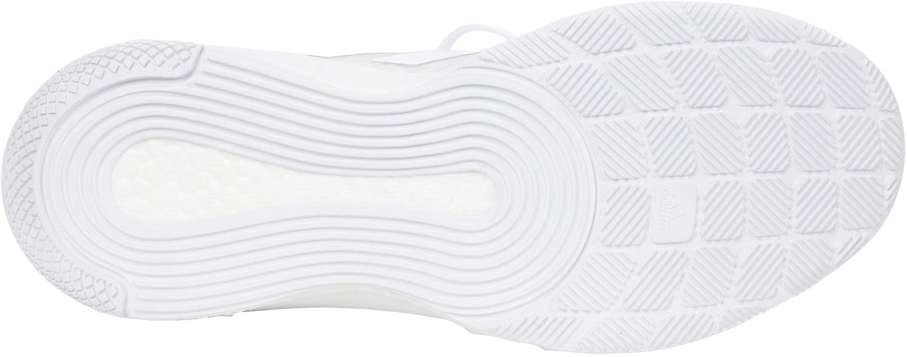
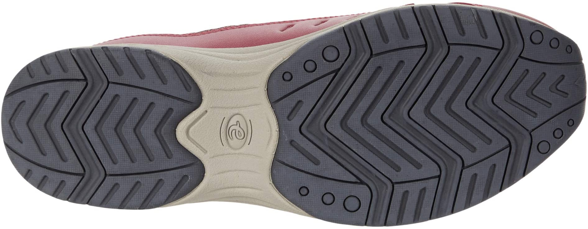
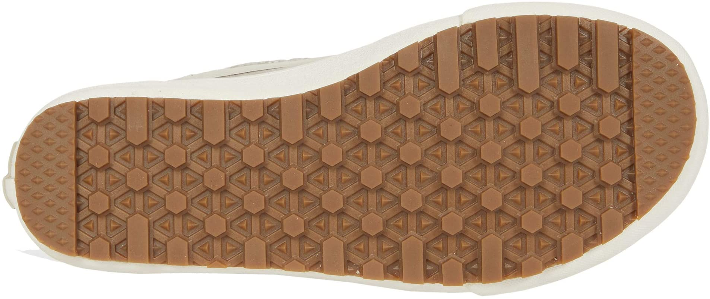

<!-- class: inverse-blue, center, middle -->
<!-- # Deep Learning: The Approach of Last Resort -->


```{r load_refs, echo=FALSE, cache=FALSE, include = F}
library(RefManageR)
BibOptions(check.entries = FALSE,
           bib.style = "numeric",
           cite.style = 'authoryear',
           style = "html",
           hyperlink = FALSE,
           no.print.fields = c("isbn", "urldate"),
           dashed = FALSE)

bb <- ReadBib("./refs.bib", check = T)
```

```{r setup, include = F}
library(tidyverse)
library(magrittr)
library(ggplot2)
library(keras)
library(furrr)
plan(multicore)
mytheme <- theme_bw() +
  theme(panel.grid.major = element_line(color = "grey50"),
        panel.grid.minor = element_line(color = "grey60"),
        plot.background = element_rect(fill = "transparent", color = NA),
        legend.background = element_rect(fill = "white", color = "grey"))

theme_set(mytheme)
knitr::opts_chunk$set(dev.args = list(bg = 'transparent'),
                      echo = FALSE, message = F, warning = F, cache = T,
                      dpi = 300, dev = 'png')


```
---
class: primary-blue
## Project Description

.pull-left-40[

].pull-right-60[
- Gather images of shoe soles from the population

- Identify features in the shoe sole patterns that make for a relatively unique description of the pattern

- Use pattern descriptions to characterize the types of shoes worn by a population

- May be useful to get a random match probability for forensic analysis
]

???

The goal of this project, in forensic space, is to develop a method for sampling and assessing which shoes are common in a local population. In order to do much of anything probabilistically with forensic shoe evidence, we need to understand the local population of potential suspects, but gathering that data is not something that has been feasible up until this point. The amazing engineering team at Iowa State has built a shoe scanner that serves kind of like a field camera in the wild. As people walk over the scanner, it takes pictures of the bottom of their shoes. At the same time, we are also working hard to ensure that the shoes are the only thing that is captured in the photo. 

The goal here is to then take the pictures we gather, identify features that describe the shoe tread pattern, and work with a basis of those pattern features to describe the local population. This may eventually help us calculate a random match probability between evidence at a crime scene and the local population.


---
class: primary-blue
## The Scanner


---
class: primary-blue
## Images





???

The scanner is able to detect the pressure being put on top of it, and then automatically take a photo of what is on top. As you might be able to notice, these images might have a little bit of reflection from either the lights in the room, or the camera itself. 

---
class: primary-blue
## Preface
- Before this scanner was built, there was no way to easily access raw images of shoe soles in the population

- Previous work on this project, had been completed on images scraped from the Zappos website

- The difference is substantial!







???

As a preface to the brilliant work done by the engineers, all of the previous work that had been done on this project had been completed on images Zappos website via web scraping. While the details of the images are very clear, it is important to note that in nature, this is almost never the case. Everyone has different wear on the treads of their shoes which will make it more difficult to identify features on the bottoms of those shoes. Now that the scanner has been built, our data will now more likely mirror that of shoe images found in a forensic space. In the grander scheme of things, we now have data and the ability to collect data that can be utilized in court to show feature tendency in local populations. in Please check out the CSAFE booth where the scanner can be demonstrated and Dr. Rick Stone can answers questions that you may have. 
---
class: primary-blue
## Data

.pull-left[
#### Online Shopping Data

- Clearer images

- Huge amounts of data available

- Not representative of a local community

- Not representative of data quality from the scanner
].pull-right[
#### Shoe Scanner data

- Tread worn down, mud/dirt, glare from the scanner, outdoor lighting conditions

- Less data available     
$<300$ im/wk over the summer

- Representative of the local community

- **Plan**: Use to update a model trained on online shopping data by tuning the model weights
]

???

When we started the project, we only had the online shopping images; now we have scanner images as well, So the plan is to train a model on the online shopping data, and then tweak/update the model weights to account for reduced data quality with the shoe scanner data once we get enough data out of the scanner to label and fit a model. 

Some of you may be wondering why we're working with specific features of the shoe pattern instead of trying to identify the specific shoe models. There are many reasons -- first, there's no database of shoe patterns out there that match to specific shoe models. Different year models actually have different patterns, and some shoe sole patterns are shared across models. In addition, there are tons of knockoffs, and shared patterns across different brands of similar types of shoes. So in my opinion, at least, it's more productive to work with tread features and not worry about identifying specific brand/style/models of shoes. 

---
class:primary-blue
## Statistical Development

- We have been able to use machine learning to fit a model that would be able to identify some features of shoes--but with a fault.

- How are we able to decipher what is actually a circle? 

- The model created was able to detect circles in places that our eyes wouldn't.


???

The other half of the battle is being able to automatically identify which class characteristics are coming the images. We have been able to use machine learning techniques to fit a model but with flaws. The major flaw is how to know when the feature in question is actually present in the image. Most of us would be able to detect when there might be a circle in an image, but the model that has been trained is able to find circles where where we otherwise would not see them. 

---
class:primary-blue
## Results from the first run?
- Here is where I was thinking the pictures of the heatmaps go
    - could be a good segway into what we are doing now?


---

class:primary-blue
## Moving forward 

- We are currently working on utilizing slightly more advanced machine learning techniques to pin point labeled class characteristics on images. 

- The new model will be able to create a box around the feature in question and correctly predict an "objectness" score of that feature. 

    - That is, this feature inside this box is 99.987% a circle. 
    
    - We would be able to place a baseline measurement of how high of the percentage needs to be.
    
???

Using state-of-the-art machine learning techniques, the plan is to keep trying to fit a model that will give us what we want. After reading literature of the best methods of object-detection, 
---
class:primary-blue
## Results


---
class:primary-blue
## Questions

- You can visit the CSAFE booth for visual demonstration of the scanner. 

- Email me at jstack9@huskers.unl.edu for any questions regarding the staistical part of the project. 
- Thank you!

